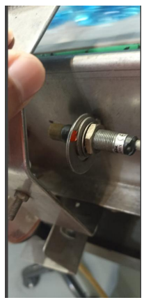
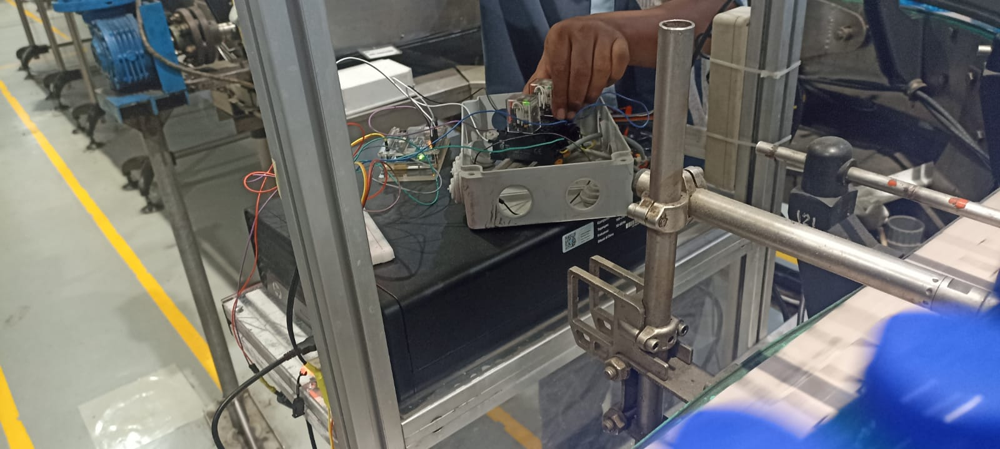

# 🏭 Mizone Line 1 Downtime & Batch Expiration Monitoring System

[](https://opensource.org/licenses/MIT)
[](https://www.arduino.cc/)
[-orange)](https://processing.org/)
[-cyan)](https://www.sehataqua.co.id/)

> **Industrial Internship Project (Laporan PKL - 2025)**  
> **Judul:** *Rancang Bangun Sistem Monitoring Gangguan Operasional (Downtime) dan Kadarluarsa Batch Blending Pada Sistem Produksi Mizone di PT Tirta Investama (AQUA) Berbasis Arduino Uno R3*  
> **Penulis:** Sultan Arief Akbar Volandra (NIM: 225090800111002)  
> **Instansi:** Program Studi S1 Instrumentasi, Departemen Fisika, FMIPA, Universitas Brawijaya  
> **Lokasi PKL:** Line 1 Mizone, Gedung BIMA Area 2, PT Tirta Investama Pandaan  

---

## 📌 Ringkasan Proyek

Proyek ini bertujuan untuk merancang dan mengimplementasikan **Sistem Pemantauan Gangguan Operasional (*Downtime*) dan Masa Kadarluarsa (*Batch Expiration*) Fluida Blending** pada lini produksi Mizone (Line 1) di pabrik PT Tirta Investama (AQUA) Pandaan.

Sistem ini dirancang untuk mengatasi permasalahan hilangnya kesadaran (*awareness*) operator dan teknisi terhadap waktu henti mesin saat terjadi kemacetan di area *packaging/labelling*. Ketika fluida Mizone yang berada di *filling tank* mengendap/tidak dialirkan selama **10 menit akibat downtime**, produk menjadi tidak layak dan harus dibuang (*waste*). Selain itu, fluida blending memiliki batas masa kadarluarsa **4 jam** setelah dialirkan dari *storage tank*.

```
 +-------------------------------------------------------------------------+
 |                           HARDWARE SENSING LINE                         |
 |                                                                         |
 |  [ Industrial Inductive Sensor 24V ] ----> [ Relay Module 24V (NC) ]   |
 |  (Turck B14U-M12-AP6X-H1141)                     |                      |
 |                                                  v                      |
 |  [ Filling Tank Push Button 24V ] -------> [ Arduino Uno R3 ]          |
 |                                            /     |      \               |
 |                   [ RTC DS3231 Module ] --/      |       \-- [ DFPlayer ]
 +--------------------------------------------------|----------------------+
                                                    | (USB Serial @ 9600)
                                                    v
 +-------------------------------------------------------------------------+
 |                            VISUALIZATION UI                             |
 |                                                                         |
 |                 [ PC Desktop - Processing GUI Framework ]               |
 |                                    |                                    |
 |                                    v                                    |
 |             [ Large Industrial TV Display Monitor (Andon) ]             |
 +-------------------------------------------------------------------------+
```

---

## 📸 Dokumentasi Hardware & Tampilan Monitor

> *Simpan foto-foto proyek Anda di folder `docs/images/` untuk menyertakan dokumentasi visual:*

|<br>**1. Tampilan Monitor Utama (Processing GUI)** | <br>**2. Pemasangan Sensor Induktif Turck 24V** |
|:---:|:---:|
|<br>**3. Modul Interfacing Relay 24V ke 5V Arduino** 
---

## ✨ Fitur-Fitur Utama

- **Real-Time Downtime Countdown (Timer Losses):** 
  - **Timer 1 (Filter Delay):** Perekaman otomatis selama 60 detik pertama untuk memvalidasi apakah *downtime* benar-benar terjadi.
  - **Timer 2 (Losses Timer):** *Countdown* otomatis dari **10:00 hingga 00:00 menit**. Jika timer habis, peringatan *waste* dinyalakan.
- **Batch Expiration Tracking (Info Expired Blending):**
  - Mengkalkulasi otomatis batas waktu kadarluarsa **4 jam ke depan** menggunakan RTC DS3231 saat *push button* pengisian Tanki A/B ditekan.
- **Visual Display Berbasis Andon (Processing GUI):**
  - Tampilan GUI resolusi tinggi dengan angka *timer* berukuran besar yang dapat terlihat jelas oleh operator dari jarak jauh.
- **Audio Alarm Alert (DFPlayer Mini):**
  - Mengeluarkan suara peringatan otomatis saat batas *downtime* kritis tercapai.
- **Safe Industrial Voltage Interfacing:**
  - Menggunakan *Relay 24V Normally Closed (NC)* untuk mengisolasi sinyal industri 24 VDC ke logika TTL 5 VDC Arduino Uno R3.

---

## 🛠️ Spesifikasi Perangkat Keras & Komponen

| Komponen | Spesifikasi / Tipe | Fungsi Utama |
|---|---|---|
| **Mikrokontroler** | Arduino Uno R3 (ATmega328P) | Pemroses logika sinyal digital dan pengendali timer |
| **Sensor Downtime** | Turck B14U-M12-AP6X-H1141 (24 VDC) | Mendeteksi posisi pengait botol pada conveyor |
| **Interfacing Module** | Modul Relay Mekanik 24V (NC Configuration) | Penyesuai level tegangan 24V industri ke 5V TTL |
| **Real-Time Clock** | RTC DS3231 (I2C Protocol) | Pencatat waktu dan kalkulator batas 4 jam expired batch |
| **Audio Module** | DFPlayer Mini + Speaker | Pemutar suara peringatan audio untuk operator |
| **Software Display** | Processing 4.x (Bahasa Java) | GUI Visualizer untuk layar TV Andon |
| **Hardware Display** | PC Desktop + TV Display Industrial | Layar monitor utama di area Line 1 Mizone |

---

## 🔌 Rangkaian Interfacing & Logika Sinyal

Sistem industri Mizone bekerja pada tegangan **24 VDC**, sedangkan Arduino bekerja pada **5 VDC**. Untuk menghubungkan kedua sistem tanpa merusak mikrokontroler, digunakan metode *Interfacing Relay NC*:

1. Sinyal 24V dari sensor induktif/push button dihubungkan ke **Coil Relay 24V**.
2. Kontak **NC (Normally Closed)** relay dialiri tegangan **5V dari Arduino** (memanfaatkan *Internal Pull-Up*).
3. Saat terjadi *downtime* (pengait tidak menyentuh sensor), sinyal 24V terputus $
ightarrow$ Relay kembali ke posisi NC $
ightarrow$ Arduino menerima sinyal **LOW/HIGH** $
ightarrow$ Timer aktif.

---

## 📊 Hasil Implementasi & Dampak Operasional

1. **Pengurangan Waste Fluida Mizone:** Operator & teknisi dapat menangani gangguan mesin sebelum timer 10 menit habis, mencegah pembuangan batch fluida.
2. **Peningkatan Awareness Operator:** Layar display besar memberikan respon visual instan terhadap status *downtime* dan masa aktif fluida blending.
3. **Integrasi Non-Invasif:** Sistem berhasil ditambahkan tanpa mengganggu atau mengubah kontrol PLC utama yang sudah ada pada Line 1.

---

## 📁 Struktur Repositori

```
.
├── arduino_firmware/
│   └── mizone_downtime_monitor/
│       └── mizone_downtime_monitor.ino   # Program logika Arduino Uno R3
├── processing_gui/
│   └── mizone_display_ui/
│       └── mizone_display_ui.pde          # Interface GUI Processing Java
├── hardware/
│   ├── schematics/                        # Skematik Proteus & Layout PCB
│   └── interface_diagram.png              # Diagram Interfacing Relay 24V-5V
├── docs/
│   ├── images/                            # Dokumentasi foto lapangan PKL
│   └── Laporan_PKL_Sultan_Volandra.pdf    # Berkas Laporan PKL
├── README.md
└── LICENSE
```

---

## 💻 Panduan Pengoperasian

### 1. Upload Code Arduino
1. Buka `arduino_firmware/mizone_downtime_monitor/mizone_downtime_monitor.ino` pada Arduino IDE.
2. Hubungkan Arduino Uno R3 via USB, pilih board **Arduino Uno**, lalu klik **Upload**.

### 2. Jalankan GUI Processing
1. Download dan buka software [Processing](https://processing.org/).
2. Buka berkas `processing_gui/mizone_display_ui/mizone_display_ui.pde`.
3. Pastikan port COM Serial sesuai dengan port Arduino Anda (contoh: `COM3`).
4. Klik tombol **Run** (atau jalankan mode *Full Screen*) untuk menampilkan layar pada TV Display.

---

## 👨‍💻 Penulis & Pembimbing

* **Penulis:** Sultan Arief Akbar Volandra (NIM: 225090800111002)[cite: 4]
* **Dosen Pembimbing:** Prof. Drs. Arinto Yudi Ponco Wardoyo, M.Sc., Ph.D.[cite: 4]
* **Pembimbing Lapang Industri:** Mochammad Antok (Performance & Method SPV PT Tirta Investama)[cite: 4]
* **Instansi:** Universitas Brawijaya & PT Tirta Investama (AQUA) Pandaan[cite: 4]

---

## 📜 Lisensi

Proyek ini dirilis di bawah **MIT License**.
